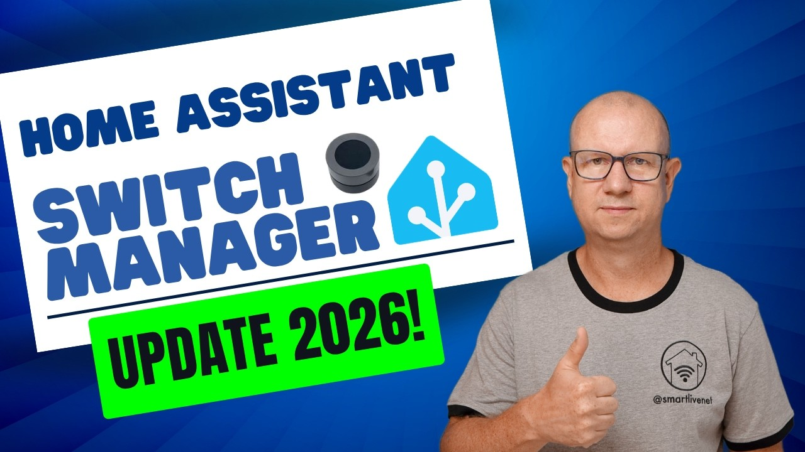
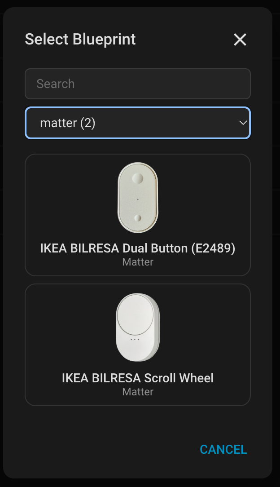
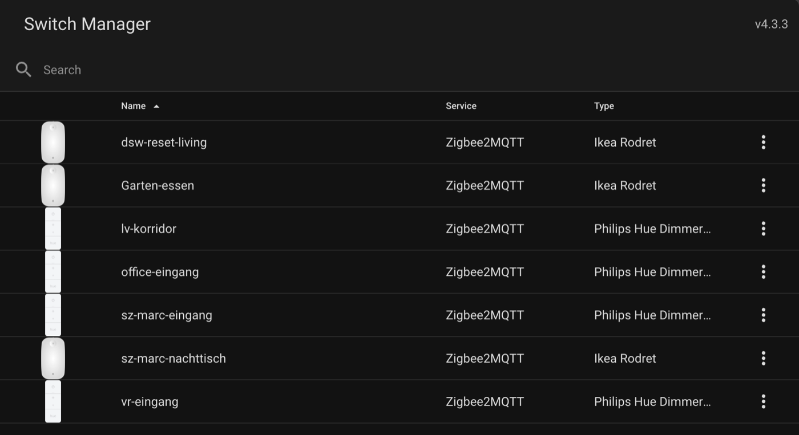
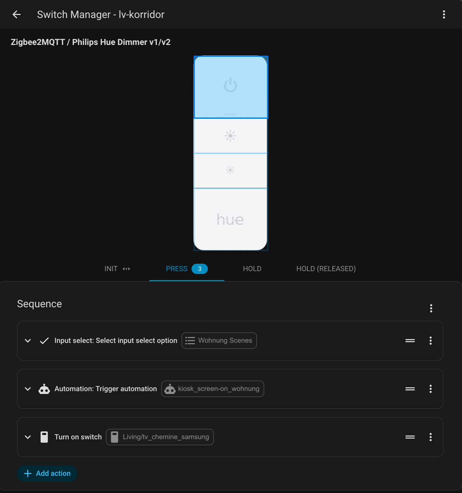
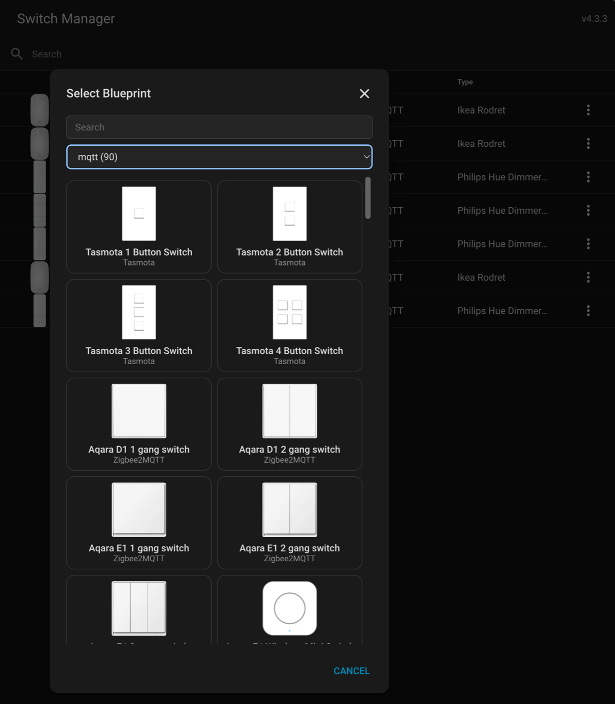
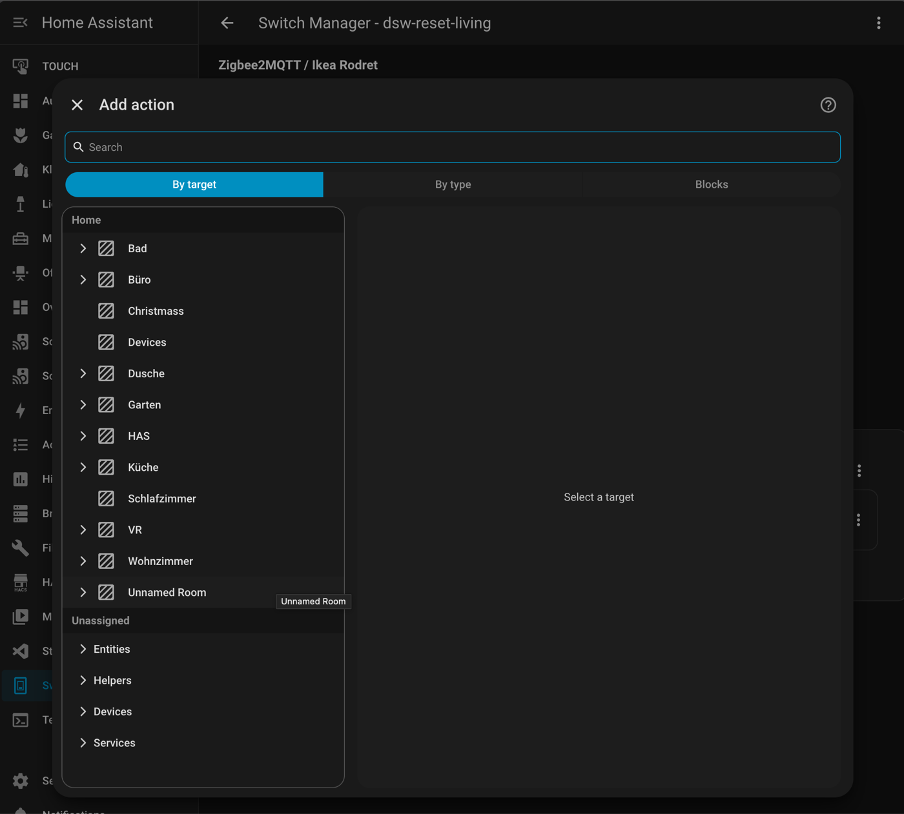
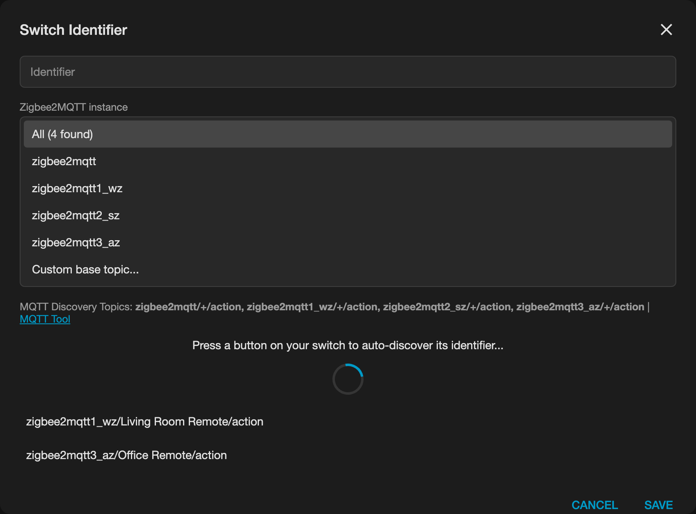

# Home Assistant Switch Manager

[](https://my.home-assistant.io/redirect/hacs_repository/?owner=macpit&repository=Home-Assistant-Switch-Manager&category=integration)

[](https://github.com/macpit/Home-Assistant-Switch-Manager/releases/latest) [](https://github.com/macpit/Home-Assistant-Switch-Manager/stargazers) [](https://github.com/macpit/Home-Assistant-Switch-Manager)

> **Switch Manager lives here now.** In August 2026 the original author, [@Sian-Lee-SA](https://github.com/Sian-Lee-SA), officially handed the project over to this repository and marked [the original repo](https://github.com/Sian-Lee-SA/Home-Assistant-Switch-Manager) as deprecated in favour of this one. Many thanks to Sian for the years of work that built Switch Manager in the first place — all development, releases, issues and pull requests now happen here.
>
> **What's new since the hand-over (v4.x):**
> - **Frontend rebuilt on Home Assistant's *current* runtime components** instead of a frozen, bundled copy. This removed the long-standing drift problem and fixed the action editor on recent HA versions: the `input_select` **Option** dropdown works again, **Targets** resolve entities/devices/areas/labels, and you get HA's modern **"Add action"** picker. Legacy UI chrome (menus, dialogs, tabs) was replaced with self-contained, drift-proof components.
> - Backend kept current with **Home Assistant 2026.x** (up to and including 2026.8).
> - **Auto-heal for blueprint updates** — when a blueprint only gains buttons or actions, your switches are lined up automatically, no more "blueprint mismatch" errors after an update.
> - **Protocol filter** in the blueprint picker, blueprint search, sortable switch list, duplicate switch, and test-firing actions straight from the editor.
> - **370+ device blueprints** — Zigbee2MQTT, ZHA, deCONZ, Z-Wave JS, Homematic, Shelly, Hue and more, with many community contributions merged.
>
> See the [releases](https://github.com/macpit/Home-Assistant-Switch-Manager/releases) for the full changelog.

> ### ⭐ Thank you for 150+ stars!
> If Switch Manager is useful to you, please give it a **[star](https://github.com/macpit/Home-Assistant-Switch-Manager/stargazers)** — it helps other Home Assistant users find the actively maintained version. 🙏

## Roadmap

We're looking for community input on what to build next! Vote by opening an [issue](https://github.com/macpit/Home-Assistant-Switch-Manager/issues) or giving a thumbs up.

| Feature | Description | Status |
|---------|-------------|--------|
| **Matter support** | Generic event-entity connection type so Matter remotes (IKEA BILRESA incl. scroll wheel, and others) can be used like any other switch ([#46](https://github.com/macpit/Home-Assistant-Switch-Manager/issues/46), [#51](https://github.com/macpit/Home-Assistant-Switch-Manager/issues/51), [PR #59](https://github.com/macpit/Home-Assistant-Switch-Manager/pull/59)) | **Done in v5.0.0** — `event_entity` connection type, IKEA BILRESA dual button and scroll wheel blueprints |
| Visual Blueprint Editor | Create blueprints in the GUI instead of writing YAML by hand ([PR #39](https://github.com/macpit/Home-Assistant-Switch-Manager/pull/39)) | In progress |
| Action Test Buttons in switch config | Fire a single configured action from the switch view ([#50](https://github.com/macpit/Home-Assistant-Switch-Manager/issues/50)) | Planned |
| Switch Groups | Apply one configuration to several physical switches ([#45](https://github.com/macpit/Home-Assistant-Switch-Manager/issues/45)) | Idea |
| Blueprint Import via URL/YAML | Import community blueprints directly from a URL or paste YAML — no manual file copying ([#77](https://github.com/macpit/Home-Assistant-Switch-Manager/issues/77)) | Idea |
| External blueprint repositories | Subscribe to community blueprint repos (GitHub repo or gist) HACS-style, so blueprints don't have to live in this repo ([#77](https://github.com/macpit/Home-Assistant-Switch-Manager/issues/77)) | Idea |
| "View on GitHub" link per blueprint | Link from the blueprint picker to the blueprint's YAML in this repo for issues and PRs ([#77](https://github.com/macpit/Home-Assistant-Switch-Manager/issues/77)) | Idea |
| Backup / Export | Export and import switch configurations as YAML for migration or backup | Idea |
| Search & replace on clone | Replace device/entity IDs when duplicating a switch ([#4](https://github.com/macpit/Home-Assistant-Switch-Manager/issues/4)) | Idea |
| Repeat until release | Hold to dim: an action repeats its sequence until the button's release event arrives ([#27](https://github.com/macpit/Home-Assistant-Switch-Manager/issues/27)) | **Done (v5.1.0)** |
| Blueprint auto-heal | Switches follow blueprints that gain buttons/actions automatically | **Done (v4.3.2)** |
| Protocol filter in blueprint picker | Filter the blueprint list by Zigbee2MQTT, ZHA, deCONZ, … | **Done (v4.2.0)** |
| Switch Cloning | Duplicate a switch from the list view three-dot menu | **Done (v3.0.6)** |
| Action Testing in Editor | Test-fire actions directly from the editor without pressing the physical switch | **Done (v3.0.7)** |

**Want something else?** [Open an issue](https://github.com/macpit/Home-Assistant-Switch-Manager/issues) and tell us!

## About

Switch manager is a centralised component to handle button pushes for your wireless switches. This includes anything passed through the event bus or MQTT. The component relies on switch blueprints which is easily made to allow GUI configuration of your switches and their button pushes. This helps remove clutter from the automations view as they will be handled independently by this component.

> [!WARNING]
> The device sequence action is currently unsupported, use service/action calls instead as this should be used thoughout Home Assistant anyway. You can literally do everything device actions can do and more just by using the standard actions. You can read more on why you shoudn't use it [here](https://community.home-assistant.io/t/why-and-how-to-avoid-device-ids-in-automations-and-scripts/605517)


#### Community

HAS Forum – [Switch Manager v5.0.0 with Matter support](https://community.home-assistant.io/t/maintained-fork-switch-manager-wireless-button-switch-action-manager-hacs-v5-0-0-with-matter-support/1022264).

#### Video

[Smart-Live](https://www.youtube.com/channel/UC9rJWdu8-jyyxo73DPevpKg) takes a look at this fork and what changed (German):

[](https://www.youtube.com/watch?v=M_hLZacsjP4)

#### New in v5: Matter, repeat until release

**v5.1:** actions with a release counterpart (hold / hold (released)) can repeat their sequence until the button is let go — hold to dim, hold to change volume. See [Repeat until release](#repeat-until-release-hold-to-dim).

Remotes added over **Matter** (here the IKEA BILRESA dual button and scroll wheel) are configured like any other switch. Switch Manager listens to their `event.*` entities, so there is nothing to set up besides picking the blueprint and pressing a button to discover the device:
<p float="left">
  
</p>

#### Screenshots (v4.3)

Switch list and switch editor — pick a button on the device image, then build a sequence per action (press / hold / …):
<p float="left">
  
  
</p>

Blueprint picker with protocol filter, and Home Assistant's native **Add action** dialog inside the editor:
<p float="left">
  
  
</p>


## How to install

### Option 1: HACS (recommended)

[](https://my.home-assistant.io/redirect/hacs_repository/?owner=macpit&repository=Home-Assistant-Switch-Manager&category=integration)

1. Open HACS in your Home Assistant instance
2. Click the three dots in the top right corner and select **Custom repositories**
3. Add `https://github.com/macpit/Home-Assistant-Switch-Manager` with category **Integration**
4. Search for "Switch Manager" and click **Download**
5. Restart Home Assistant
6. Go to Settings -> Devices & services -> Add integration and add Switch Manager

### Switching from the original repo

If you have [Sian-Lee-SA/Home-Assistant-Switch-Manager](https://github.com/Sian-Lee-SA/Home-Assistant-Switch-Manager) installed and want to switch to this fork:

1. Remove the old `custom_components/switch_manager` folder (or uninstall via HACS)
2. Restart Home Assistant
3. Install this fork via HACS (see Option 1 above) or manually (see below)
4. Restart Home Assistant

Your switch configurations are stored separately in `/homeassistant/.storage/switch_manager` and will **not** be deleted when you remove the integration — all your configured switches will come back automatically.

> **Tip:** The `.storage` folder is hidden by default in the File Editor add-on. To see it, go to the add-on settings, remove `.storage` from the ignore list (or disable `Enforce Basepath`), and also remove `.storage` from the filename filter at the bottom.

### Option 2: Manual installation

1. Download the [latest release](https://github.com/macpit/Home-Assistant-Switch-Manager/releases)
1. Place the folder `custom_components/switch_manager` into the `config/custom_components/` path of your Home Assistant installation
1. Restart Home Assistant
1. Go to Settings -> Devices & services -> Add integration and add Switch Manager

> [](https://my.home-assistant.io/redirect/config_flow_start/?domain=switch_manager)

Once the integration has been loaded, a folder with blueprints will be created in your `config/blueprints/switch_manager` home assistant path. You can add/create extra blueprints to this path.

## How to use

In the side panel you goto Switch Manager. Next click `Add Switch` and select the switch blueprint for the service/integration it's on (If you can't find your service and switch then see [Blueprints](#blueprints) below). The same switch can be defined multiple times but not for different services as they differ their event data's from one another. 

Once you've selected the blueprint, you will be taken to the switch editor view. 

#### Identifier

There will be an identifier or mqtt topic input box within the identifier dialog which can be opened from the top right menu. 

You can either enter the identifier manually or use the auto discovery button then press a button on the switch to autofill the value. There is a posibility that an identifier from some other device for the event to be discovered if that device sent an event before your button push. If this is the case and the button helper isn't getting the right identifier then you can manually find the information needed by clicking the Event|MQTT Tool link then listen for the event type needed or MQTT topic via `#`. 

##### Zigbee2MQTT base topic / multiple instances

Zigbee2MQTT blueprints are written for the default base topic `zigbee2mqtt`. The identifier dialog looks up the Zigbee2MQTT instances actually running on your broker (via their retained `<base_topic>/bridge/state` message) and offers them in a **Zigbee2MQTT instance** dropdown. By default discovery listens on **all** detected instances, so a renamed base topic (e.g. `zigbee2mqtt1_wz`) or several coordinators work out of the box; pick a single instance to narrow it down, or **Custom base topic...** to type one yourself. If no instance is detected (e.g. Zigbee2MQTT has never been online since the broker started) the dialog falls back to the blueprint default.

<p align="center"></p>

**For other MQTT services (e.g. Tasmota): if you have changed the default MQTT base topic and are using a blueprint provided by Switch Manager, enter the topic manually as discovery listens on the default topic only.**

##### Don't know event value

If you do not know the event value then click the **Event Tool** link in the identifier dialog or goto Developer Tools -> Events and start listening for events (use * if you're unsure of the event type for your switch). Once you've started listening for events, push a button on your switch then stop the listener. View the data and you will find the event related to your switch. Inside that data you will find the identifier's value. Copy this value to the identifier's textbox on the switch editor page to bind.

##### Don't know MQTT topic

If using a MQTT service then you can either download MQTT Explorer (preferred) or listen to all topics using the MQTT integration's listener. Click the **MQTT Tool** link in the identifier dialog or go to Settings -> Devices & services -> MQTT -> Configure. Next listen to the topic `#` (which means all topics), after pressing a button you will see a topic representing this, this would be your MQTT topic for Switch Manager (you can cross reference the MQTT Discovery Topic and blueprint with the mqtt data if you want to be sure).

#### Interacting with buttons

Depending on the blueprint and the actions that your switch supports, you can select buttons by clicking on them from the image displayed and each button can have multiple actions eg press, double press and hold etc. 

Navigation and usage should be pretty straight forward.

Remember to save before leaving the page when changes has been made! Once saved you can test to make sure all is working.

#### Repeat until release (hold to dim)

For actions that have a release counterpart in the blueprint (e.g. **hold** / **hold (released)**) the sequence editor shows a **Repeat until …** toggle next to the mode selector. When enabled, the sequence runs again and again while the button is held and stops as soon as the release event arrives. A typical use is dimming: a `light.turn_on` with `brightness_step_pct: -5` as the **hold** sequence and the toggle enabled.

* **Interval (ms)** is the pause between two runs (default 250, 50–5000).
* Use script mode `single` or `restart` for looping actions; `queued` / `parallel` are pointless here.
* Devices that keep sending *hold* while pressed only extend the running loop, they do not start a second one.
* If the release event gets lost the loop stops on its own after 15 seconds.
* In YAML the action carries `loop: true` and `loop_interval: 250`.

Blueprints pair actions automatically by title (`hold` → `hold (released)`, or a single `released` / `release` action on the same button). Blueprint authors can override this with `released_by` on the action.

> Sometimes you may want certain buttons or actions handled by the devices default handler. For example, a Zigbee device may already be bound to a certain light which also imo has better response, reliability and stability. To remind you of this, you could add a stop action with a description of why the button shouldn't be changed and being handled somewhere else. Then for other actions that aren't handled elsewhere then you can handle them with this component. It's also fine to allow an external handler to handle the button push aswell as this component so a button could turn on the light handled via Zigbee and the component could start playing music based on the same switch action.

#### Variables

You can assign variables to the switch from the top right menu, these variables can be access through the blueprint conditions or action sequences.

The event or MQTT data can also be accessed inside your sequences via the data variable.

#### Action `switch_manager.set_variables`

You can use the action (service) `switch_manager.set_variables` to dynamically set variables for a switch. You need to supply the switch id which can be found on the identifier dialog, url or through debugging. Add new or replace variables through the code editor (yaml formatted). These variables will be reset on save, Home Assistant restart or Switch Manager reload so it's ideal to be used for temporary references. **Note: Set Variables will be saved if the switch has been saved after using the service call**

If using the service within the switch itself, then you can just get the switch id by using `data.switch_id`.

#### button_last_state Variable

This is a special variable that you can use in your template conditions etc. This is very handy if you want something like where you're holding a button then you're pressing another button which will execute a different action within your sequence.

##### action key

When the switch is updated or saved it will reset the states to null. But when you execute an action for a button this will be stored as a last state under the action sub key. **Remember that index's start from 0**. So, if you want to check the last action from the first button defined in the blueprint and see if it's last action was the second one then you would do `data.button_last_state[0].action == 1` with 1 being the action index of that button.

##### title key

Alternatively you can test against the title of the action for better readability via the title key `data.button_last_state[0].title == 'hold'`. This method is case sensitive and needs to match the title in the blueprint which is normally all lower case to what's displayed in the editor.  

##### timestamp key

You can also access the unix timestamp that the action was executed by accessing `data.button_last_state[0].timestamp`, this can allow you to determine which button and what action was last executed or calculate how long ago the same button and action was excecuted by also accessing `data.timestamp` which is the current timestamp for the current button and action. `data.timestamp - data.button_last_state[0].timestamp` will give how much time has passed in seconds and milliseconds via decimal point since the button action of the first button to the current button and action (referencing the same button and action will give the last time it was executed and not the current execution).

You could use a choose sequence action that checks whether any other button is held and handle an action for that. Be creative! Keep in mind that this is less useful with press actions etc as they're reset upon a switch reload/save where as a hold/rotate action is more useful as they're called in an active state.

Turn on debugging and open your dev console to see the button_last_state variable and it's values.

##### Example for Philips Hue Tap Dial

Below is an example choose sequence action where if the 4th button is being held down while rotating the dial either clockwise or anti-clockwise then it will either increase or decrease the volume respectively on any playing speakers.

```yaml
# This being the clockwise rotation (change service media_player.volume_up 
# to media_player.volume_down for anti-clockwise)
choose:
  - conditions:
      - condition: template
        value_template: "{{ data.button_last_state[3].action == 1 }}"
    sequence:
      - service: media_player.volume_up
        data:
          entity_id: >-
            {{ ['media_player.study_monitor_speakers', 
            'media_player.living_room_speakers', 
            'media_player.kitchen_speaker',  'media_player.family_room_hub',
            'media_player.master_bedroom_hub'] | select('is_state', 'playing') |
            list }}
```

Furthermore, you could also test which button was last pressed as to determine which lights to dim via the dial.

## Blueprints

Blueprints are the heart of this component, once a blueprint is defined for a switch then it can be reused for all switches for that specific service and type. All blueprints are yaml defined and needs to be placed inside the `config/blueprints/switch_manager` path eg `config/blueprints/switch_manager/philips-hue-tap.yaml`. For a more user friendly experience and for switches with multiple buttons then a png file should be placed with the same name (case sensitive) eg a philips-hue-tap.yaml blueprint image would be `config/blueprints/switch_manager/philips-hue-tap.png`.

#### File names

File names should be defined as {service-name}-{switch-name-or-type}.yaml and all lower case. If you don't plan on posting your blueprint for others to use then it would be a good idea to prefix your file names with something unique like mycustom-{service-name}-{switch-name-or-type}.yaml. This way when you update the component with new blueprints then it won't overwrite your personal made ones if they happen to have the same file name.

#### Images

* Only PNG files are currently supported.
* Images should not exceed 500px height or 800px width
* Images with transparent background are preferred
* If single button and is a **module** then a picture of the module should be used. Otherwise if the module has multiple buttons (endpoints), then a generic switch picture should be used (you may also add a small image of the module within the generic switch art)

I tend to just google the device under the images tab. Next I will skim through til I find an image that has a flat perspective (top down) and is above 800px or 500px depending on the switches ratio. Next I will open the image in photoshop then mask out the background area with the shape tool. I then control click the layer to make only the visible selected which I then crop. Lastly I resize the image to be either 800px width or 500px height depending on which one has a greater value but I do not upscale if the image is below those sizes.

Once a blueprint file or image file has been created or edited then you will need to either call the `switch_manager.reload` action or restart Home Assistant for the changes to take effect.

#### Debug

Once a switch is saved, you can enable debugging through the top right menu up in the top right. List conditions will use what ever is in the data object (you do not need to add data to your keys) while Template conditions and sequence templates will need to access the data variable (eg data.{event_key} ).

Once enabled, open your browser dev console to view debugging output.

### Root Structure

The following tables shows how to structure a blueprint yaml file.
> View other blueprint files to get a grasp on how it's constructed if the following table is hard to understand.

Option          | Values       | Required | Details
--              | -            | -        | -
name            | `string`     | *        | A friendly name for the switch
service         | `string`     | *        | The service or integration that this switch relates to (matching services will be grouped when selecting a blueprint from gui)
event_type      | `string`     | *        | Must match the event type through the event bus triggered by the switch (Monitor `*` events in developer tools if unsure of its value). Set this to mqtt if handling a mqtt message instead of an event (see [mqtt](#mqtt)) or to `event_entity` for remotes that surface as `event.*` entities such as Matter devices (see [Event entities](#event-entities-matter))
identifier_key  | `string`     | * If not mqtt       | The key in the event data that will uniquely identify a switch. For `event_entity` blueprints this is `device_id`.
mqtt_topic_format| `string`    | -        | If event_type is mqtt, then this will give the user an understanding of what they should set their topic as. example: zigbee2mqtt/+/action. The MQTT topic here will also help with discovery (remember to use wildcard `+` where needed). **Make sure you set this to the standard topic if planning on sharing blueprint and not a topic that you have customised yourself through the integration**
mqtt_sub_topics | `bool`       | -        | Along with the original topic, sub topics will also be listened to and passed in for condition checking etc. If enabled then make sure the original topic doesn't use `#` wildcards or `+` at the end. Default is false
info            | `string`     | -        | You can add any additional information needed for the blueprint for users to read that wouldn't understand how it operates or has some **noteworthy** information
buttons         | `list` [Button](#button) | * | You will need to define a list of buttons even if the switch has only one or multiple. See [Button](#button) for details on defining a button
conditions      | `list` [Condition](#condition) \| `string` [Template](https://www.home-assistant.io/docs/configuration/templating/) | - | This optional list or [Template](https://www.home-assistant.io/docs/configuration/templating/) allows the switch to only accept these conditions within the event data or mqtt payload. All conditions must evaluate to true to be valid. See [Condition](#condition) for details on defining a condition

### Button

If there are more than 1 button on the switch then you should be using a png (even one button should have an image for better visualisation) and defining the buttons position with the x, y, width and height properties. This also can be expanded to being a circular shape or a svg path.

If a switch supports multiple button presses (so two buttons are pushed at the same time) then add another button with circle shape centered between the two buttons to indicate they're linked. Within the actions, the title should prefix **both**. See [Xiaomi Double Key](https://github.com/macpit/Home-Assistant-Switch-Manager/blob/master/custom_components/switch_manager/blueprints/zigbee2mqtt-xiaomi-double-key-wxkg07lm.yaml) for an example.

> You will need to save the switch before feedback will be displayed on the UI, this is due to needing backend processing of a switch which isn't created until it's been saved.

> if you want more control on positioning and look then you can open the image up in inkscape (with matching width and height values for the viewBox) then draw the paths for each button and copy the d attribute of that path then paste in the d property for the button in yaml.

> Single button switches must **not** contain shape properties.

* Shape `rectangle` uses x, y, width, height
* Shape `circle` uses x, y, width
* Shape `path` uses d

Option          | Values                        | Required | Details
--              | -                             | -        | -
x               | `int`px                       | -        | The x (left, right) position of the button from top left within the image. *not valid for shape: path
y               | `int`px                       | -        | The y (up, down) position of the button from top left within the image. *not valid for shape: path
width           | `int`px                       | -        | The width of the shape rectangle or circle. *not valid for shape: path
height          | `int`px                       | -        | Only valid for shape: rectangle. The height you want the rectangle to be
d               | `string`                      | -        | Only valid if shape: path. Using svg path format
actions         | `list` [Action](#action)      | *        | Each button will have atleast one action. Each action would be the result of a press, double press or hold etc depending on what the switch supports.
conditions      | `list` [Condition](#condition) \| `string` [Template](https://www.home-assistant.io/docs/configuration/templating/) | -        | This optional list or [Template](https://www.home-assistant.io/docs/configuration/templating/) allows the button to only accept conditions within the event data or mqtt payload. This can help scope down to where the button was pressed. All conditions must evaluate to true to be valid. See [Condition](#condition) for details on defining a condition. 

### Action

An action would be the result of a press, whether its held down or if it was pressed twice etc (all depending on what the device and/or service supports). An action must contain a title at minimum. Conditions should be used to differentiate the actions for any button.

#### Title naming convention

To unify switches added to Switch Manager, it makes sense to conform to a naming convention so the below dot points are some rules to go by.

* All characters should be lowercase
* If a button has a initial press action (where it's always called before other actions) then this should be called **init**, this is useful for setting timers and other initiating actions 
* If button then the action should be **press**. This is generally the release of a short press and **not** the moment the button was pressed as this would generally be **init**
* If action is double press or triple press and so on then the action should be **press 2x** or **press 3x** and so on
* If the button supports a hold/long and hold/long release then there should be an action for both **hold** and **hold (released)** do **NOT** use the wording **long**. This pairing is also what enables [Repeat until release](#repeat-until-release-hold-to-dim) for the **hold** action; use `released_by` only if you cannot follow the naming
* Do **NOT** use **short** or **short release** as this is generally a generic **init** or **press**
* In the case where a switch allows multiple buttons to be pushed then you can prefix each action with **both** so a dual button press would be **both press** and **both press 2x** etc. This makes it clear to a user that the button they have selected is actually for multiple buttons. See [Xiaomi Double Key](https://github.com/macpit/Home-Assistant-Switch-Manager/blob/master/custom_components/switch_manager/blueprints/zigbee2mqtt-xiaomi-double-key-wxkg07lm.yaml) for an example


#### Order convention

Actions should be ordered logically. This would be **init** -> **press** -> **press 2x** -> **press 3x** -> **hold** -> **hold (released)** -> Then anything that is more unique like **shake**, **viabrate** and so on.

Option          | Values                          | Required | Details
--              | -                               | -        | -
title           | `string`                        | *        | Please read naming convention to better understand what title should be used
conditions      | `list` [Condition](#condition) \| `string` [Template](https://www.home-assistant.io/docs/configuration/templating/)  | -        | This optional list or [Template](https://www.home-assistant.io/docs/configuration/templating/) allows the action to only accept conditions within the event data or mqtt payload. This can help scope down to the kind of action if the button has multiple. All conditions must evaluate to true to be valid. See [Condition](#condition) for details on defining a condition. 
scale_field     | `string` \| `list`             | -        | Name(s) of numeric service data fields (`data` / `service_data` / `event_data`) that are multiplied by the event's press or notch count (`data.presses`) before the sequence runs **once**. Meant for relative values like `brightness_step_pct` on a scroll wheel so the user's action stays a plain step without templates. If the sequence contains none of the fields (e.g. `media_player.volume_up`) it runs once per press/notch instead.
repeat          | `string`                        | -        | Name of a numeric field in the event data (e.g. `presses`) used as a repeat count; the whole sequence runs that many times in order. Use for discrete actions (next track, scene cycling). `scale_field` wins if both are set. Both are capped at 50.
released_by     | `string`                        | -        | Title of the action on the same button whose event ends a *repeat until release* loop of this action. Derived automatically from `hold` → `hold (released)` (or a lone `released` / `release`), so only needed for other naming.

### Condition

Conditions will traverse down the switch from root -> button -> action. The process of the heirachy will stop if the condition fails. Please use list over templates.

#### Template

You can use Home Assistant generic condition template to validate a condition https://www.home-assistant.io/docs/configuration/templating/. Define the property `conditions` as a string instead of an array. Lists are still preferred as rendering templates takes extra processing times. The event or mqtt data are passed in on the data variable. Switch defined variables can be accessed through the `data.variables` object.

##### template example
```yaml
conditions: "{{ data.value == 'KeyPressed' and data.topic_basename == 'left_button' }}"
```

#### List

Conditions defined as a list evaluates the event/mqtt data. If the key doesn't exist then it also evaluates to false. Use dot notation for the key to traverse nested dictionaries. Switch defined variables can be accessed using the `variables` key. **All conditions must be true to be valid**.

Option          | Values       | Required | Details
--              | -            | -        | -
key             | `string`     | *        | The key to match in the event data or mqtt payload
value           | `string`     | *        | The value to match for the key

##### list example
```yaml
conditions:
  - key: value
    value: KeyPressed
  - key: group
    value: 1
```

### Event entities (Matter)

Matter remotes (and some other integrations such as Hue or Zigbee2MQTT with HA discovery) do not fire a bus event. Each button is an `event.*` entity whose state changes on every press while `attributes.event_type` says what happened. Blueprints with `event_type: event_entity` listen to those state changes; the switch identifier is the Home Assistant **device id** of the remote (auto discovery shows the device name, just press a button) and the data the conditions see is:

Key             | Details
--              | -
event_type      | The event, e.g. `multi_press_1`, `multi_press_2`, `long_press`, `long_release`
presses         | Press / notch count of the event (`totalNumberOfPressesCounted` or the `N` in `multi_press_N`), default 1. Used by `scale_field` and `repeat`
entity_id, device_id, unique_id, original_name, platform | Registry details of the entity that fired
endpoint        | Matter endpoint number parsed from the unique id (`None` for non Matter entities). Handy to tell buttons apart, see the BILRESA blueprints
entity_index    | 0 based position of the entity among the device's `event.*` entities, ordered by endpoint. Stable even when the user renames entities
attributes      | All remaining entity attributes are also available at the top level (e.g. `previousPosition`, `newPosition`)

```yaml
name: IKEA BILRESA Dual Button (E2489)
service: Matter
event_type: event_entity
identifier_key: device_id
buttons:
  - conditions:
      - key: entity_index
        value: 0
    actions:
      - title: press
        conditions:
          - key: event_type
            value: multi_press_1
```

### MQTT

MQTT is handled differently to events and the incoming data is that of a payload... If a payload is not json formatted then it will be passed in as the key `payload` containing the string. The payload itself is what the conditions will check against. Included in the data is topic and topic_basename as this can be useful for condtions where a topic is listened via `#` or `+`.

To help discover a switch when trying to discover from GUI then use a format for the topic in `mqtt_topic_format` that will scope down to the best possibility. For zigbee2mqtt this is generally `zigbee2mqtt/+/action`. Blueprints with that format also receive the `action` key from the device's state topic `zigbee2mqtt/<device>` as `payload` (see [troubleshooting](#a-zigbee2mqtt-switch-is-never-discovered--does-nothing)), so they work whether or not Zigbee2MQTT's Home Assistant integration republishes to `/action`. The `+` is a wild card saying to match a single level (so anything between the forward slash `/`). For more information visit [here](https://www.hivemq.com/blog/mqtt-essentials-part-5-mqtt-topics-best-practices/). Sharing blueprints should be set to the default topic of the integration and not one that you have changed to. 

If you want a condition on a payload that isn't json formatted then you would do as follows:
```yaml
- key: payload
  value: tap
```

Otherwise you will check against the payloads keys and values.

### Blueprint Examples

The follow example is a blueprint for a Wallmote Quad which has 4 buttons with each button having 2 actions (press and hold). This blueprint is also designed for the Z-Wave JS Integration and handles the event type `zwave_js_value_notification`. With in that we set the identifier key to `node_id` as this key is a way to distinguish which switch the event refers to. Further along we check from the root condition whether the event data has `property: scene` otherwise the switch has no need to further proceed nor does the component process other child conditions. We do this again for the buttons and actions to scope down whether the incoming event should be handled by the switch and its buttons or actions.

Each button has a shape of a path as it was traced through inkscape, drawing the shapes whether be rectangle, circle or path allows GUI representation and allows to select individual buttons within the GUI switch editor.

> You should wrap your conditon values in qoutes as 001 equates to an int which would end up being 1 and will not match a value of 001 within the event data.

```yaml
name: Wallmote Quad
service: Z-Wave JS
event_type: zwave_js_value_notification
identifier_key: node_id
conditions:
  - key: property
    value: scene
buttons:
  - d: m 45.944466,2.0341694 h 176.769524 v 219.3817306 h -219.1028571 l 0,-177.048398 a 42.333333,42.333333 135 0 1 42.3333331,-42.3333326 z
    conditions:
      - key: property_key
        value: '001'
    actions:
      - title: press
        conditions:
          - key: value
            value: KeyPressed
      - title: hold
        conditions:
          - key: value
            value: KeyHeldDown
  - d: m 222.78056,2.0572453 h 176.76953 a 42.333333,42.333333 45 0 1 42.33333,42.3333327 v 177.048392 h -219.10286 z
    conditions:
      - key: property_key
        value: '002'
    actions:
      - title: press
        conditions:
          - key: value
            value: KeyPressed
      - title: hold
        conditions:
          - key: value
            value: KeyHeldDown
  - d: m 3.4383569,221.24492 h 219.1028631 v 219.38173 h -176.76953 a 42.333333,42.333333 45 0 1 -42.3333331,-42.33333 z
    conditions:
      - key: property_key
        value: '003'
    actions:
      - title: press
        conditions:
          - key: value
            value: KeyPressed
      - title: hold
        conditions:
          - key: value
            value: KeyHeldDown
  - d: m 222.71397,221.28836 h 219.10286 v 177.0484 a 42.333333,42.333333 135 0 1 -42.33333,42.33333 l -176.76953,0 z
    conditions:
      - key: property_key
        value: '004'
    actions:
      - title: press
        conditions:
          - key: value
            value: KeyPressed
      - title: hold
        conditions:
          - key: value
            value: KeyHeldDown
```

#### MQTT Example

```yaml
name: Sonoff SNZB 01
service: Zigbee2MQTT
event_type: mqtt
mqtt_topic_format: zigbee2mqtt/+/action
buttons:
  - actions:
      - title: press
        conditions:
          - key: payload
            value: single
      - title: press 2x
        conditions:
          - key: payload
            value: double
      - title: hold
        conditions:
          - key: payload
            value: long
```


## Troubleshoot

#### Update broke my switch causing blueprint mismatch

When a blueprint only *gains* buttons or actions, the switch is lined up with it automatically since v4.3.2 — everything you configured keeps its position and the new actions are simply added empty.

You only see the mismatch error when a blueprint *dropped* buttons or actions, because sequences would be lost there and that is your call to make. Edit the switch and click **fix**, then check that your actions and sequences are still in the right spots.

#### A Zigbee2MQTT switch is never discovered / does nothing

Most Zigbee2MQTT blueprints are written for `zigbee2mqtt/<device>/action`. That topic is not published by Zigbee2MQTT itself — it is republished by its **Home Assistant integration**, so it only exists when in Zigbee2MQTT the Home Assistant integration is **enabled** (`homeassistant.enabled: true`) and `advanced.output` is `json` (the default). The `legacy_action_sensor` option is unrelated.

Since v5.3.0 this no longer matters for the switch itself: for `/action` blueprints Switch Manager also listens on the device's state topic `zigbee2mqtt/<device>` and uses the `action` key of its JSON payload (`{"action": "1_single", ...}`) as if it had arrived on `/action`. When Zigbee2MQTT publishes both, the second copy of a press is dropped, and retained state messages are ignored so a restart never replays the last press. The identifier of such a switch stays `zigbee2mqtt/<device>/action`, and auto discovery finds the device either way.

If a switch still does nothing, check with any MQTT client (or the Zigbee2MQTT frontend) that pressing the button publishes on `zigbee2mqtt/<device>` (or `.../action`) at all, and that the topic matches the identifier of the switch, including the base topic (see [Zigbee2MQTT base topic](#zigbee2mqtt-base-topic--multiple-instances)).

#### The panel looks unchanged after an update

Reload the Home Assistant page (Ctrl/Cmd+Shift+R). A browser tab that was open while the integration was updated keeps running the old panel code — the websocket reconnects on its own, the JavaScript does not.

